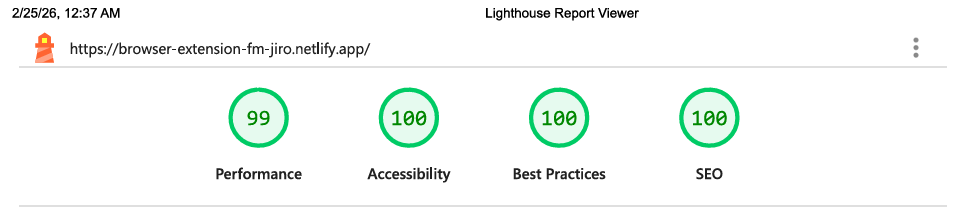

# Browser Extension Manager

[](https://react.dev)
[](https://vitejs.dev)
[](https://tailwindcss.com)
[](https://vitest.dev)
[](https://testing-library.com)


[](https://www.frontendmentor.io/)
[](https://git-scm.com/)
[](https://github.com/)
[](https://www.netlify.com/)
[](https://chrome.google.com/webstore/detail/perfectpixel-by-welldonecod/dkaagdgjmgdmbnecmcefdhjekcoceebi)


[](/docs/downloads/lighthouse-performance-report.pdf)

[](https://browser-extension-fm-jiro.netlify.app/)


## An Interactive Browser Extension Manager UI

A fully responsive browser extension manager interface featuring dynamic data rendering, state toggling, filtering, and theme selection.

| _Mobile Preview (375x812)_                                  | _Desktop Preview (1440x960)_                                   |
| ----------------------------------------------------------- | -------------------------------------------------------------- |
|       |       |
|  |  |

---

## Overview

Browser Extension Manager is a fully responsive, state-driven interface that allows users to manage installed browser extensions through filtering, activation toggling, removal, undo actions, and restoration workflows.

Built with React and custom hooks, the application models soft-deletion, persistent storage, deterministic ordering, and accessible modal interactions. The project emphasizes predictable state management, separation of concerns, and behavior-driven testing.

Created as part of the building challenges from **[Frontend Mentor](https://www.frontendmentor.io/)**.

---

## Live Demo

You can check out the live website **[here](https://browser-extension-fm-jiro.netlify.app/)**

---

## Features

- State-driven filtering (All / Active / Inactive) with ARIA-compliant toggle controls
- Soft-delete pattern with confirmation modal
- Undo and restore flows (individual and bulk restore)
- Persistent state using `localStorage` (extensions + removed items)
- Deterministic reordering based on original data source
- System-aware theme switching with `prefers-color-scheme` support
- Dynamic asset loading using Vite’s `import.meta.glob`
- Comprehensive testing (hook unit tests + UI integration tests)
- Accessible dialogs and keyboard-friendly interactions

---

## Tech Stack

**Libraries & Frameworks:** [](https://react.dev/)
[](https://tailwindcss.com/)

**Core Technologies:** [](https://developer.mozilla.org/en-US/docs/Web/HTML)
[](https://developer.mozilla.org/en-US/docs/Web/CSS)
[](https://developer.mozilla.org/en-US/docs/Web/JavaScript)
[](https://www.markdownguide.org/)

**Tooling & Testing:** [](https://vitejs.dev/)
[](https://vitest.dev/)
[](https://testing-library.com/docs/react-testing-library/intro/)

**Platforms & Deployment:** [](https://git-scm.com/)
[](https://github.com/)
[](https://www.netlify.com/)
[](https://code.visualstudio.com/)
[](https://www.figma.com/)

---

## Development Workflow

This project uses a **[feature-based branching workflow](https://github.com/CodingWithJiro/frontend-mentor-browser-extension-manager/network)** with descriptive commits and **[structured pull requests](https://github.com/CodingWithJiro/frontend-mentor-browser-extension-manager/pulls?q=is%3Apr+is%3Aclosed)**, mirroring professional team collaboration practices:

[](https://github.com/CodingWithJiro/frontend-mentor-browser-extension-manager/network)

---

## Performance Report

[](docs/downloads/lighthouse-performance-report.pdf)

A **Google Lighthouse** audit was conducted on the final version of this project. You can view the **[full report here](docs/downloads/lighthouse-performance-report.pdf)**.

---

## How to Run

Open a terminal and type:

```bash
git clone https://github.com/CodingWithJiro/frontend-mentor-browser-extension-manager.git
cd frontend-mentor-browser-extension-manager
npm install
npm run dev
```

---

## Testing

Open a terminal and type:

```bash
npm test
```

---

## What I Learned

- Thinking beyond simple CRUD interactions and modeling UI state as a system (removal → confirmation → toast → undo → restore)
- Designing state in a way that supports future flexibility, not just immediate UI changes
- Separating business logic from presentation using custom hooks to improve clarity, reusability, and testability
- Handling real-world persistence using `localStorage` and managing side effects safely with `useEffect`
- Working with native browser APIs like `<dialog>` and understanding their behavior in both the browser and test environments
- Writing integration tests that simulate real user behavior instead of testing implementation details
- Managing deterministic data ordering to avoid unpredictable UI results
- Using build tool features like `import.meta.glob` to automate asset handling and reduce manual code repetition
- Recognizing how accessibility decisions (ARIA, semantic elements) influence both UI design and testing strategy

---

## Author

Created by **Elmar Chavez**

Month/Year: **January - February 2026**

Journey: **10<sup>th</sup> - 11<sup>th</sup>** month of being a _frontend developer_.

[](https://www.linkedin.com/in/elmar-chavez/)
[](mailto:chavezelmar03@gmail.com)
[](https://github.com/CodingWithJiro)
[](https://www.frontendmentor.io/profile/CodingWithJiro)
[](https://app.daily.dev/elmarchavez)
